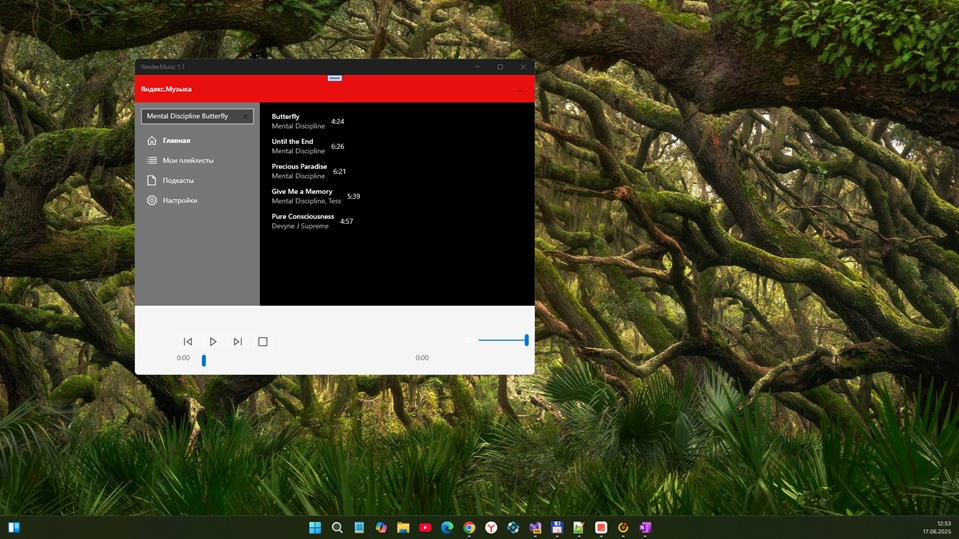
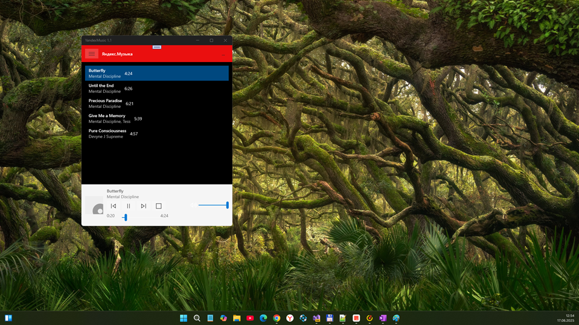
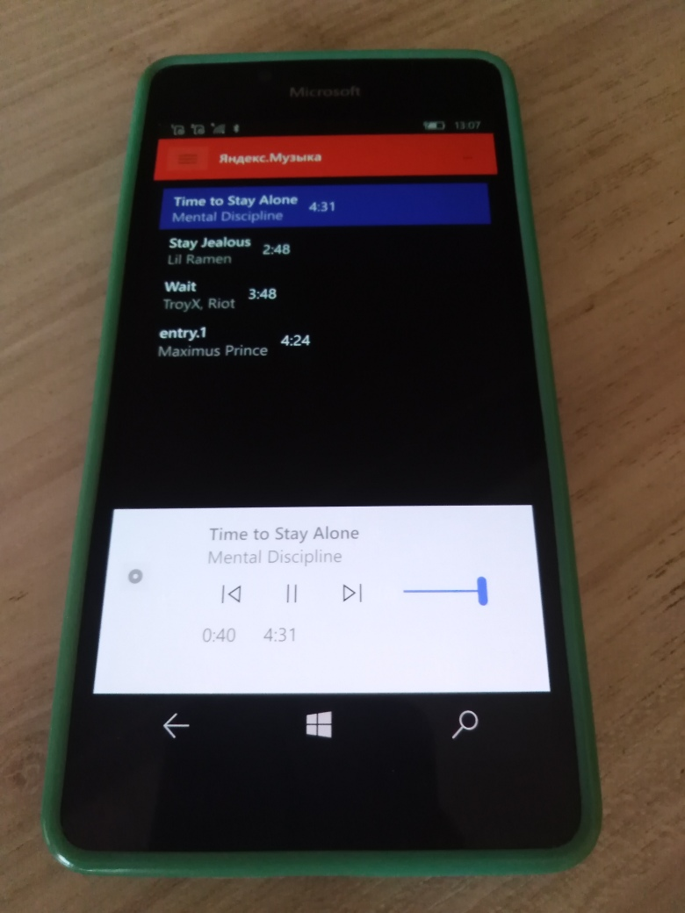
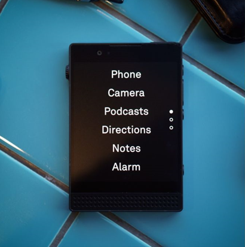

# Yandex.Music 1.1 - main branch 

My 2nd attempt to remake YandexMusic uwp app. This is planned as very lite edition of YandexMusic client (with only simplest function: search&play song "item").

## Abstract
At now this thing allows you to get some music analytics music through Yandex integration in the simplest uwp app for Windows 10 / 11 (and, perhaps, for W10M, or ol sweet Windows 10 Mobile!)

I decided to share my dialogue with Trae AI.. how to create Yandex Music uwp app "template-prototype". ;)
So, look at Wiki: https://github.com/mediaexplorer74/YandexMusic/wiki/

## Screenshots

## Solution (app) structure
- Special uap version of Yandex.Music.Api lib (Win SDK 16299 used. Draft)
- Auto-gererated (with help of Trae AI IDE) Yandex.Music UWP app (Win SDK 16299 used. Draft)

## Status 
- Yandex.Music "Ultra-lite" assembled for W10M (ARM, Min. WinSDK = 15063) 
- Experimental background playback mode added
- Playback progress bar & Volume slider fixed
- Adaptive UI added (Gamburger menu, etc.)

## Description
This project was created as a proof-of-concept over a short amount of time. 
The code may not be perfect. It exists for demonstration and educational purposes. So, it's just-for-fun!

## How to use it / try it
- Use your Desktop PC. Open Yandex Music site via Google Chrome (or Yandex Browser), auth and find Access token (cookee) in Developer Mode.  
- Run my YandexMusic app, tap Settings, save your token, then try to search&play some song. :)  

## Coding "workbench"

1. Visual Studio 2022

2. .NET Standard 2.0

3. Win SDK 16299 / 15063

 

## Project status
- phase 1 Intro/RnD +- 50/100
- phase 2 Design - 10/100
- phase 3 Tech. project - 50/100
- phase 4 Dev. project  +- 30/100
- phase 5 Tests/Intro   - 7/100

## Bugs
- If press "..." after auth and then press "Back" all music tracks were hide (deleted?)… it's strange
- If done new music search when music is playing then strange "echo" appeared (background mode errors?)

## Contribute!
There's still a TON of things missing from this proof-of-concept (MVP) and areas of research & development (RnD). So, feel free to fork or improve this project!  

- https://www.trae.ai Trae AI site (I used IDE for Windows for VS-compatible project auto-generation!)
- https://github.com/Trae-AI/ GitHub "Trae-AI Corner" :)
- https://github.com/K1llMan/Yandex.Music.Api K1llMan Yandex.Music.Api C# Project
- https://github.com/MarshalX/yandex-music-token Open-sourced Access Token "getters" 

## TODO
- Improve UI a little more
- Extend functionality (Albums, Popular Tracks, Janres, ...)
- Port Yandex.Music.API lib to UAP 14393 or .NET Standard 1.4 (for brave!)

## License
Distributed under the MIT License.

## ..
As is. No support. RnD only. DIY.

## .
[m][e] June, 17 2025

